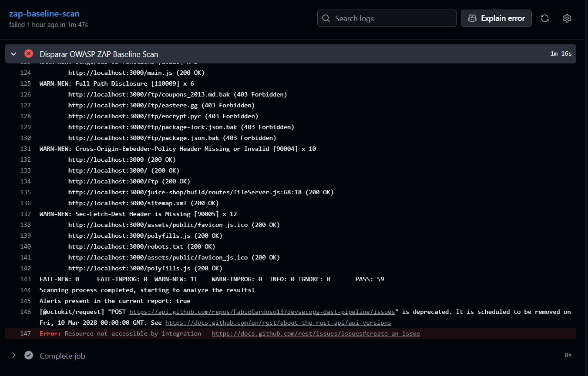

# Automated DAST & Continuous Penetration Testing

## About the Project
This project demonstrates the implementation of **Dynamic Application Security Testing (DAST)** within a CI/CD pipeline. It showcases the ability to transition from manual penetration testing methodologies to automated, continuous security validation. 

By integrating offensive security tools directly into the deployment workflow, this pipeline ensures that web applications are dynamically attacked and audited for runtime vulnerabilities (such as SQL Injection, Cross-Site Scripting, and insecure headers) on every integration cycle.

## Technologies & Toolchain
* **Orchestration:** GitHub Actions
* **Security Scanner (DAST):** OWASP ZAP (Zed Attack Proxy)
* **Target Application:** OWASP Juice Shop (Deployed via Docker)

## Pipeline Architecture & Ephemeral Testing
Unlike Static Analysis (SAST), DAST requires a running instance of the application. This pipeline orchestrates a temporary testing environment entirely within the GitHub Actions runner:

1. **Target Spin-Up:** A vulnerable Node.js web application (OWASP Juice Shop) is pulled from Docker Hub and launched in the background of the CI/CD runner.
2. **Automated Attack:** The official OWASP ZAP Action is triggered to run a Baseline Scan against the newly spun-up local container.
3. **Vulnerability Detection:** ZAP aggressively crawls the application and launches active/passive scans to identify misconfigurations and runtime flaws.
4. **Tear Down & Reporting:** Once the scan concludes, a report is generated, and the temporary container is destroyed.

## Security Value & Impact
This repository highlights a core DevSecOps principle: **Scaling Offensive Operations**. 

Instead of relying solely on periodic, manual Red Team assessments, this automated pipeline acts as a continuous adversary. It catches low-hanging fruit and regression vulnerabilities instantly, allowing human security analysts to focus their manual efforts on complex logical flaws and advanced exploit chaining.

## Execution Evidence

*The GitHub Actions runner successfully deploying the target and launching the OWASP ZAP attack sequence:*

## Key Takeaways
Integrating DAST into the CI/CD pipeline ensures that security is tested not just at the code level, but in the actual runtime environment, mimicking a real-world attacker's perspective.
